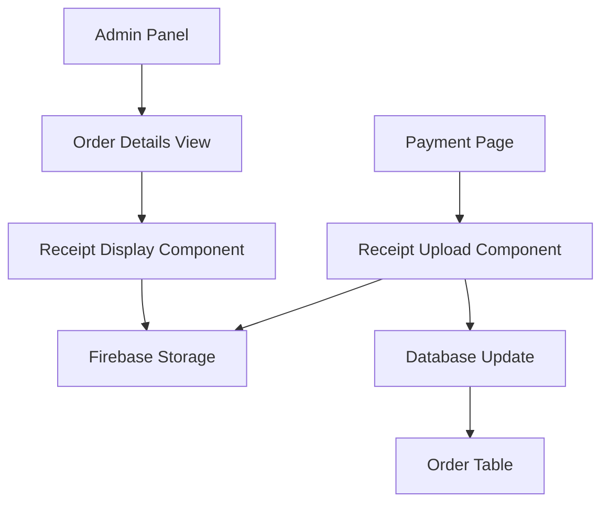

# Design Document

## Overview

Esta funcionalidade implementa um sistema de upload de comprovantes de pagamento integrado ao processo de checkout existente. O sistema reutiliza a infraestrutura atual de upload de imagens (Firebase Storage) e estende o modelo de dados para incluir comprovantes associados aos pedidos.

## Architecture

### High-Level Architecture



### Integration Points

1. **Frontend Integration**: Integração com a página de pagamento existente (`app/(website)/payment/page.jsx`)
2. **Storage Integration**: Utilização do Firebase Storage já configurado
3. **Database Integration**: Extensão do modelo Order no Prisma
4. **Admin Integration**: Extensão das páginas administrativas existentes

## Components and Interfaces

### 1. ReceiptUpload Component

**Location**: `components/ui/receiptUpload.jsx`

**Props**:
```javascript
{
  orderId: string,
  onUploadSuccess: () => void,
  onUploadError: (error: string) => void,
  required: boolean = true
}
```

**Features**:
- Drag and drop interface similar to existing uploadImage
- File validation (jpg, jpeg, png, webp, max 5MB)
- Progress indicator during upload
- Preview of selected image
- Error handling and user feedback

### 2. ReceiptViewer Component

**Location**: `components/admin/receiptViewer.jsx`

**Props**:
```javascript
{
  orderId: string,
  onStatusUpdate: (newStatus: string) => void
}
```

**Features**:
- Attempt to fetch receipt image from Firebase Storage using orderId
- Display receipt image with zoom functionality if found
- Show "no receipt" message if Firebase returns 404/not-found
- Status update controls (approve/reject payment)
- Loading states and error handling

### 3. Enhanced Payment Page

**Location**: `app/(website)/payment/page.jsx` (modified)

**New Features**:
- Integration of ReceiptUpload component
- Form validation requiring receipt upload
- Standard order creation (no database changes needed)
- Enhanced user flow with receipt confirmation

### 4. Enhanced Admin Order View

**Location**: `app/admin/order/[id]/page.js` (modified)

**New Features**:
- Dynamic receipt image loading from Firebase with automatic fallback
- Payment validation controls
- Status update functionality
- Automatic receipt existence detection

## Data Models

### Database Schema Changes

**Nenhuma alteração necessária no banco de dados!**

A existência de comprovantes será determinada dinamicamente através de tentativas de busca no Firebase Storage. Isso elimina completamente a necessidade de sincronização entre banco e storage.

**Receipt URL Generation**:
A URL do comprovante será construída dinamicamente usando a estrutura do Firebase:
```javascript
const getReceiptUrl = (orderId) => {
  return `receipts/${orderId}/receipt.jpg`; // ou extensão apropriada
}
```

### Firebase Storage Structure

```
/receipts/
  /{orderId}/
    /receipt.{extension}
```

**Naming Convention**: `receipts/{orderId}/receipt.{extension}`

### Dynamic Receipt URL Resolution

Em vez de armazenar a URL no banco, o sistema construirá dinamicamente a URL do comprovante:

```javascript
// Utility function para construir URL do comprovante
const buildReceiptPath = (orderId) => {
  return `receipts/${orderId}/receipt.jpg`;
};

// Função para verificar se comprovante existe e obter URL
const getReceiptUrl = async (orderId) => {
  const storage = getStorage();
  const receiptRef = ref(storage, `receipts/${orderId}/receipt.jpg`);
  
  try {
    const url = await getDownloadURL(receiptRef);
    return url;
  } catch (error) {
    if (error.code === 'storage/object-not-found') {
      return null; // Comprovante não existe
    }
    throw error; // Outro erro
  }
};
```

**Vantagens desta abordagem**:
- Elimina duplicação de dados entre Firebase e banco
- Sempre sincronizado (fonte única da verdade)
- Menos complexidade de sincronização
- Estrutura de dados mais limpa

## Error Handling

### Upload Errors

1. **File Size Exceeded**: "Arquivo muito grande. Tamanho máximo: 5MB"
2. **Invalid File Type**: "Formato inválido. Use apenas JPG, PNG ou WebP"
3. **Network Error**: "Erro de conexão. Tente novamente"
4. **Storage Error**: "Erro no servidor. Contate o suporte"

### Display Errors

1. **Receipt Not Found**: "Comprovante não encontrado"
2. **Loading Error**: "Erro ao carregar comprovante"
3. **Permission Error**: "Sem permissão para visualizar"

### Error Recovery

- Automatic retry for network errors (max 3 attempts)
- Graceful degradation when receipt cannot be displayed
- Clear error messages with actionable steps

## Testing Strategy

### Unit Tests

1. **ReceiptUpload Component**:
   - File validation logic
   - Upload progress handling
   - Error state management
   - Props validation

2. **ReceiptViewer Component**:
   - Image display functionality
   - Status update logic
   - Error handling

3. **Database Operations**:
   - Order creation with receipt URL
   - Receipt URL updates
   - Query operations

### Integration Tests

1. **Upload Flow**:
   - End-to-end upload process
   - Firebase Storage integration
   - Database persistence

2. **Admin Flow**:
   - Receipt display in admin panel
   - Status update functionality
   - Permission validation

### E2E Tests

1. **Complete Purchase Flow**:
   - User uploads receipt during checkout
   - Order is created with receipt
   - Admin can view and validate receipt
   - Status is updated successfully

2. **Error Scenarios**:
   - Upload failures
   - Invalid file types
   - Network interruptions

## Security Considerations

### File Upload Security

1. **File Type Validation**: Server-side validation of file types
2. **File Size Limits**: Maximum 5MB per file
3. **Malware Scanning**: Consider integration with antivirus scanning
4. **Access Control**: Only authenticated users can upload

### Storage Security

1. **Firebase Rules**: Restrict access to receipt folders
2. **URL Security**: Use signed URLs for temporary access
3. **Admin Access**: Only admin users can view receipts

### Data Privacy

1. **LGPD Compliance**: Proper handling of payment proof images
2. **Data Retention**: Define retention policy for receipt images
3. **Access Logging**: Log access to sensitive receipt data

## Performance Considerations

### Upload Optimization

1. **Image Compression**: Automatic compression before upload
2. **Progressive Upload**: Show progress during large file uploads
3. **Retry Logic**: Automatic retry for failed uploads

### Display Optimization

1. **Lazy Loading**: Load receipt images only when needed
2. **Caching**: Cache receipt URLs for faster subsequent loads
3. **Thumbnail Generation**: Generate thumbnails for admin list views

## Implementation Notes

### Reusable Code

- Leverage existing `uploadImage.jsx` component logic
- Reuse Firebase configuration and utilities
- Extend existing admin table components

### Migration Strategy

1. **Database Migration**: Add new columns to Order table
2. **Backward Compatibility**: Handle orders without receipts
3. **Gradual Rollout**: Feature flag for controlled deployment

### Monitoring

1. **Upload Success Rate**: Track successful vs failed uploads
2. **Storage Usage**: Monitor Firebase Storage consumption
3. **Admin Usage**: Track receipt validation activities