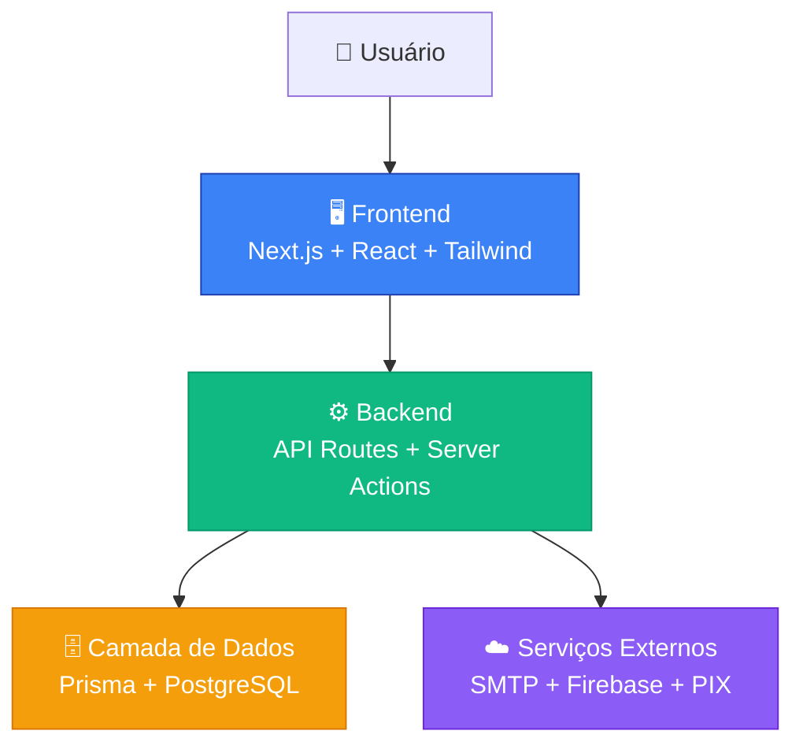
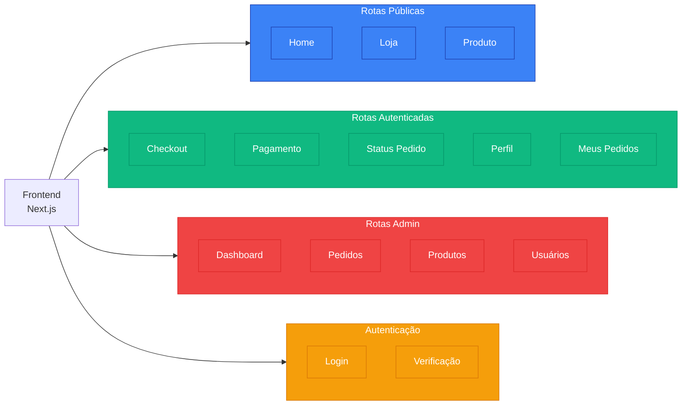
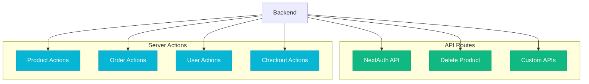
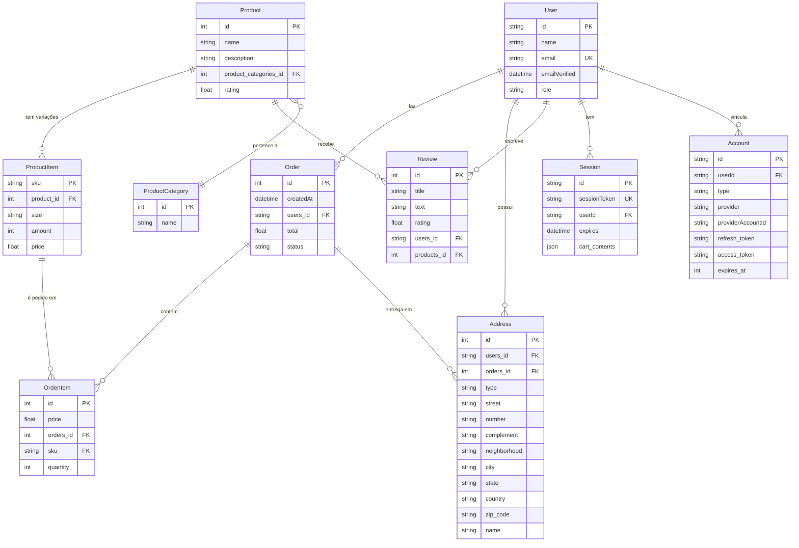
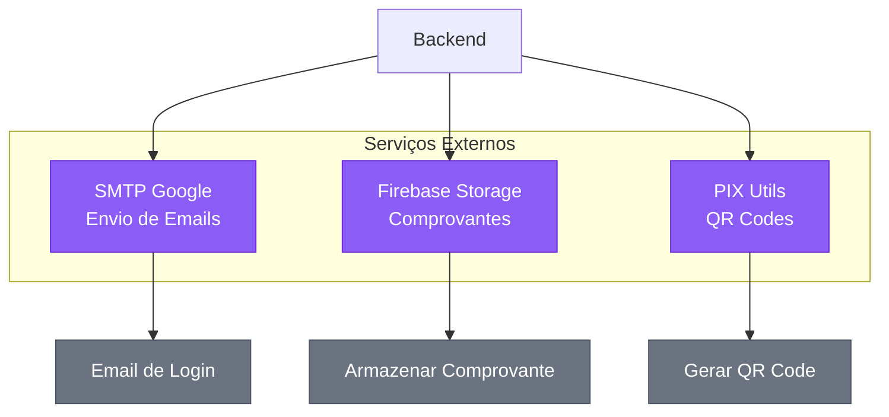
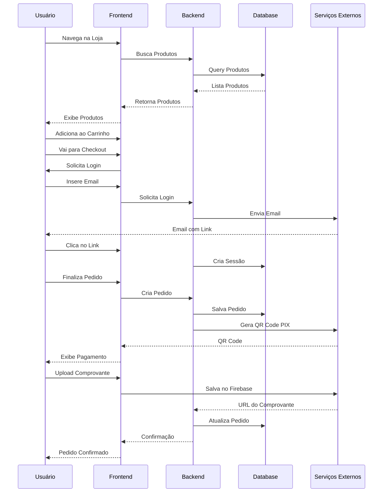

# Arquitetura do Sistema SHOPIC

## Descrição

A estrutura do projeto SHOPIC organiza-se em camadas bem definidas, garantindo uma clara separação de responsabilidades dentro de um monorepo Next.js 14. O frontend, desenvolvido em React com App Router e estilizado com Tailwind CSS, oferece uma experiência de usuário fluida e responsiva através de rotas públicas (loja, produtos, checkout), rotas autenticadas (perfil, pedidos) e um painel administrativo completo para gestão de produtos, pedidos e usuários.

O backend, implementado como API Routes e Server Actions do Next.js, gerencia toda a lógica de negócio: autenticação passwordless via NextAuth com magic links por email, autorização baseada em roles (user/admin), processamento de pedidos, gestão de estoque e validações complexas. A comunicação com o banco de dados PostgreSQL é realizada através do Prisma ORM, garantindo type-safety e queries otimizadas.

O sistema integra-se a serviços externos essenciais: SMTP Google para envio de emails de autenticação, Firebase Storage para armazenamento seguro de comprovantes de pagamento PIX, e a biblioteca PIX Utils para geração de QR Codes de pagamento. Essa arquitetura unificada, aliada à separação lógica de componentes e à utilização de Server Components e Client Components de forma estratégica, adere às melhores práticas do desenvolvimento moderno, priorizando performance, manutenibilidade e escalabilidade.

## Diagrama Geral da Arquitetura



## 1. Camada Frontend - Estrutura de Rotas



## 2. Camada Backend - APIs e Server Actions



## 3. Camada de Dados - Prisma e PostgreSQL

### Diagrama Entidade-Relacionamento



### Relacionamentos Principais

- **User → Order**: Um usuário pode fazer vários pedidos (1:N)
- **Order → OrderItem**: Um pedido contém vários itens (1:N)
- **Product → ProductItem**: Um produto tem várias variações de tamanho/SKU (1:N)
- **ProductItem → OrderItem**: Um item de produto pode estar em vários pedidos (1:N)
- **Product → ProductCategory**: Produtos pertencem a uma categoria (N:1)
- **User → Address**: Um usuário pode ter vários endereços (1:N)
- **Order → Address**: Um pedido é entregue em um endereço (1:N)

## 4. Serviços Externos



## 5. Fluxo Completo de Compra



## Camadas do Sistema

### 1. **Frontend (Apresentação)**
- **Framework**: Next.js 14 com App Router
- **UI**: React Components + Tailwind CSS
- **Bibliotecas UI**: Tremor (tabelas e dashboards)
- **Gerenciamento de Estado**: React Context (CartContext, AuthProvider)
- **Responsabilidades**:
  - Renderização de páginas e componentes
  - Interação com usuário
  - Validação de formulários
  - Navegação entre rotas

### 2. **Backend (Lógica de Negócio)**
- **API Routes**: Endpoints REST internos do Next.js
- **Server Actions**: Funções server-side para operações de dados
- **Autenticação**: NextAuth.js com provider de email
- **Responsabilidades**:
  - Processamento de requisições
  - Validação de dados
  - Regras de negócio
  - Autorização e controle de acesso

### 3. **Camada de Dados**
- **ORM**: Prisma
- **Banco de Dados**: PostgreSQL
- **Responsabilidades**:
  - Persistência de dados
  - Queries otimizadas
  - Migrations e schema management
  - Transações e integridade referencial

### 4. **Serviços Externos**
- **SMTP Google**: Envio de emails de autenticação
- **Firebase Storage**: Armazenamento de comprovantes de pagamento
- **PIX Utils**: Geração de QR Codes PIX

### 5. **Utilitários**
- **orderStatusTranslator**: Tradução de status de pedidos
- **receiptStorage**: Gerenciamento de comprovantes
- **tailwind.js**: Configurações customizadas do Tailwind

## Fluxo de Dados

### Fluxo de Autenticação
```
Usuário → /auth/signin → NextAuth API → SMTP → Email → Link Mágico → Sessão Criada
```

### Fluxo de Compra
```
Usuário → /shop → /product/[id] → /checkout → /payment → Upload Comprovante → /statusPedido/[id]
```

### Fluxo Admin
```
Admin → /admin → Dashboard → Gerenciar Pedidos/Produtos/Usuários → Server Actions → Prisma → PostgreSQL
```

## Tecnologias Principais

| Camada | Tecnologia | Versão |
|--------|-----------|--------|
| Frontend | Next.js | 14.x |
| UI | React | 18.x |
| Styling | Tailwind CSS | 3.x |
| Backend | Next.js API Routes | 14.x |
| ORM | Prisma | Latest |
| Database | PostgreSQL | Latest |
| Auth | NextAuth.js | Latest |
| Storage | Firebase | Latest |
| Email | Nodemailer | Latest |

## Segurança

- ✅ Autenticação via email (magic links)
- ✅ Sessões gerenciadas pelo NextAuth
- ✅ Controle de acesso baseado em roles (user/admin)
- ✅ Validação server-side em todas as operações
- ✅ Proteção de rotas admin
- ✅ Sanitização de inputs

## Escalabilidade

- ✅ Server-side rendering (SSR) para SEO
- ✅ Static generation onde possível
- ✅ API Routes para operações assíncronas
- ✅ Prisma para queries otimizadas
- ✅ Revalidação de cache estratégica
- ✅ Componentes reutilizáveis
